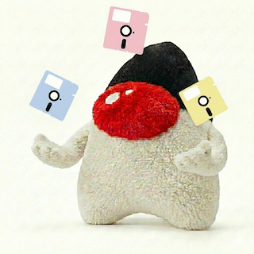
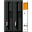
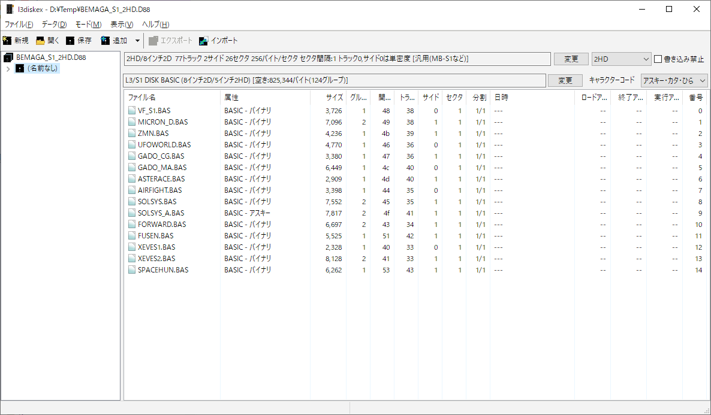

[](https://jitpack.io/#umjammer/vavi-nio-file-l3diskex)
[](https://github.com/umjammer/vavi-nio-file-l3diskex/actions/workflows/maven.yml)
[](https://github.com/umjammer/vavi-nio-file-l3diskex/actions/workflows/codeql.yml)


# vavi-nio-file-l3diskex



a Java nio filesystem SPI powered by [l3diskex](https://github.com/bml3mk5/L3DiskEx)

you can also mount all formats using [fuse](https://github.com/umjammer/vavi-nio-file-fuse).

### Status

|                                                    | ext | physical | parser | logical    | status | spi |                    |
|----------------------------------------------------|-----|----------|--------|------------|:------:|:---:|--------------------|
| NEC N88-BASIC / NEC N66-BASIC                      | FDI | fdi      | FDI    |            |   ✅️   | ✅️  | pc-98              |
|                                                    | VFD | v98fdd   | VFD    |            |        |     | pc-98              |
|                                                    | d88 | d88      | D88    | N88        |   ✅️   | ✅️  |                    |
| MS-DOS FAT12 (PC-9801/PC-AT)                       |     |          |        | MSDOS      |   ✅️   | ✅️  | pc-98              |
| System Soft for PC-8001 PC-DOS                     |     |          |        | Dos80      |        |     |                    |
| Frost-DOS                                          |     |          | D88    | Frost      |   ✅️   | ✅️  | pc-88              |
| Magical DOS                                        |     |          | D88    | Magical    |   ✅️   | ✅️  |                    |
|                                                    |     |          |        | Falcom     |        |     | pc-88              |
| FUJITSU F-BASIC                                    | d77 | d88      | D88    | FAT8F, FM  |        |     |                    |
| TOSHIBA PASOPIA T-BASIC                            | d88 |          | D88    | (PA)       |        |     |                    |
| SHARP X68000 Human68k (FAT12)                      | STR | dskstr   | STR    | HU68K      |        |     | x68k, pc-98        |
| DIFC.X                                             | DIM | difcdim  | DIM    |            |        |     | x68k IMAGING       |
| SHARP X1/MZ Hu-BASIC / S-OS SWORD                  |     |          |        | X1HU       |        |     |                    |
| SHARP MZ S-BASIC                                   |     |          |        | MZ         |        |     |                    |
| SHARP MZ Floppy DOS                                |     |          |        | MZFDos     |        |     |                    |
| TF-DOS                                             |     |          |        | TFDos      |        |     | mz (c-dos co?)     |
| Carry Lab. C-DOS                                   |     |          |        | CDos       |        |     | mz, pc-88          |
| Carry Lab. CDOS II                                 |     |          |        | CDos       |        |     | mz, pc-88          |
| MSX-BASIC / MSX-DOS                                |     |          |        | MSX        |        |     | msx (cp/m co)      |
| X-DOS                                              |     |          |        | XDos       |        |     | x1 (s-dos co)      |
| S-DOS / Sn88-DOS                                   |     |          |        | SDos       |        |     | sord               |
| HITACHI LEVEL-3 DISK BASIC / HITACHI S1 DISK BASIC |     |          |        | L31S, L32D |        |     | (s-dos co)         |
| SORD M68 KDOS (FDOS)                               |     |          |        | M68FDos    |        |     | (s-dos co)         |
| L-os Angeles                                       |     |          |        | LOSA       |        |     | x1, msx (s-dos co) |
| MDOS                                               |     |          |        | MDos       |        |     | pc80 (s-dos80 co?) |
| CASIO FP-1100 C82-BASIC                            |     |          |        | FP         |        |     |                    |
| SONY SMC-777 Sony Filer                            | 1dd |          |        | (SMC)      |        |     | (CP/M co)          |
| CP/M Ver.2.2                                       |     |          |        | CPM        |        |     |                    |
| Apple DOS 3.3                                      |     |          |        | AppleDOS   |        |     |                    |
| Apple ProDOS 8/16                                  | 2MG | 2mg      | 2MG    | ProDos     |        |     | AppleII GS         |
| Apple disk copy                                    | ADC | adc      | ADC    |            |        |     | IMAGING            |
| Commodore 1541 DOS (Commodore 64)                  | G64 | g64      | G64    | C1541      |        |     | commodore          |
| Commodore Amiga DOS / AROS                         |     |          |        | Amiga      |        |     | commodore          |
| TRS-80 emulator?                                   | DMK | dmk      | Dmk    | TRSDos     |        |     | TRS-80             |
| Jeff's Model III/4 emulator for MS-DOS             | JV3 | jv3      | JV3    | TRSDos     |        |     | TRS-80 emu         |
| FLEX                                               |     |          |        | FLEX       |        |     | FlexOS             |
| OS-9 Level I/II                                    |     |          |        | OS9        |        |     |                    |
| Amstrad CPC                                        | DSK | cpcdsk   | Dsk    |            |        |     | Amstrad CPC        |
| teledisk image format                              | TD0 | teletd0  | TD0    |            |        |     | IMAGING            |
| HFE HxC Floppy Emulator file format                | HFE | hfe      | Hfe    |            |        |     | IMAGING            |
| ImageDisk                                          | IMD | imd      | IMD    |            |        |     | IMAGING            |
| CopyQM                                             | CQM | cqmimg   | CQM    |            |        |     | IMAGING            |
|                                                    |     | plain    | Plain  |            |        |     |                    |

## Install

* [maven](https://jitpack.io/#umjammer/vavi-nio-file-l3diskex)

## Usage

### JSR-203 & fuse

```java
    URI uri = URI.create("l3:file:///foo/bar.d88");
    fs = FileSystems.newFileSystem(uri, Collections.emptyList());
    Fuse fuse = Fuse.getFuse().mount(fs, MOUNT_POINT, Collections.emptyList());
```

### sample

 - [sample](src/test/java/TestCase.java)

### system property

 * `l3diskex.normalize.enabled` ... do normalize or not when checking disk

### SPIs

 * `l3diskex.basicfmt.DiskBasicDirItem` ... directory item spi
 * `l3diskex.basicfmt.DiskBasicType` ... type (logical format) spi
 * `l3diskex.diskimg.DiskParser$DiskImageParser` ... disk image (physical format) parser spi
 * `l3diskex.diskimg.DiskWriter$DiskImageWriter` ... disk image (physical format) writer spi

## References

* https://github.com/bml3mk5/L3DiskEx
* https://github.com/davidgiven/fluxengine
* http://dunfield.classiccmp.org//img/index.htm
* https://docs.google.com/spreadsheets/d/1vA5V1RVu62bW5hsOeuh0jwxBbzRQtnMfmhNjPHSWKWM/edit?gid=945940239#gid=945940239 🔐

### Lesson

* The `BasicFileAttributes#isDirectory` method is the key to determining if a file is a directory.

## TODO

* ~~\[serdes] check deserialized objects that need to serialize again~~
* ui
* ~~use service loader for type, dir-item, parser, writer~~
* ~~spi~~
* ⚠️ root directory doesn't have directory attribute bit. see DiskBasicDirItem#getFileAttr
* \[msdos] encoding, timestamp
* \[serdes] not use `InputStream` directly but after reading data into buffer use `ByteArrayInputStream` for performance
* ~~\[magical] dir loops (only spi)~~ ... empty name in dir list

---

#  [Original](https://github.com/bml3mk5/L3DiskEx)

Copyright(C) Sasaji 2015-2024 All Rights Reserved.



---

L3 Disk Explorer is an application in order to access to files in a floppy disk image for retro computer and operating system.

#### Supported DISK BASIC / OS：

```
HITACHI LEVEL-3 DISK BASIC / HITACHI S1 DISK BASIC
FUJITSU F-BASIC
NEC N88-BASIC / NEC N66-BASIC
MSX-BASIC / MSX-DOS
MS-DOS FAT12 (PC-9801/PC-AT)
SHARP X1/MZ Hu-BASIC / S-OS SWORD
SHARP MZ S-BASIC
SHARP MZ Floppy DOS
SHARP X68000 Human68k (FAT12)
TOSHIBA PASOPIA T-BASIC
SONY SMC-777 Sony Filer
CASIO FP-1100 C82-BASIC
FLEX
OS-9 Level I/II
CP/M Ver.2.2
Apple DOS 3.3
Apple ProDOS 8/16
Commodore 1541 DOS (Commodore 64)
Commodore Amiga DOS / AROS
SORD M68 KDOS (FDOS)
TF-DOS
Carry Lab. C-DOS
Carry Lab. CDOS II
System Soft PC-8001用 PC-DOS
X-DOS
Frost-DOS
Magical DOS
S-DOS / Sn88-DOS
L-os Angeles
MDOS
```

---

#### Disclaimer

* This is the free software. I have not abandoned the copyright.
  And each author which created the source code also have the copyright.
* No warranty: We are not responsible for any damage caused by this software.

---

MailTo: Sasaji (sasaji@s-sasaji.ddo.jp)
* http://s-sasaji.ddo.jp/bml3mk5/
* GitHub:     https://github.com/bml3mk5/L3DiskEx
* X(Twitter): https://x.com/bml3mk5

---

<sub>image designed by @umjammer, drawn by nano banana, disk image by <a href="https://freesvg.org/floppy-disk-icon">freesvg.org</a></sub>
